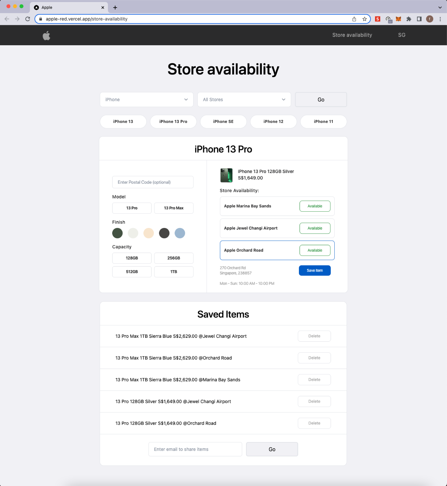

# Take Home Assignment - Apple

[Apple - Check Store Availability - Demo Link](https://apple-red.vercel.app/store-availability)

[Repo](https://github.com/faithchan/store-availability/tree/main/store-availability)

## 🌌 Introduction

A Web App to help call agents at Apple check availability for a product at a physical Apple Store. The App aims to showcase a mock up and an example of the aforementioned scenario. The scope of the project touches country, stores in country (particularly Singapore in version 1 of this App), product family, breakdown from the product family (particularly iPhone 13 Pro in version 1 of this App).

## 👨🏻‍💻 Project Structure

- Breakdown the products Apple has into Product Families - using the reference of the tabs on Apple website.
- Focus on a product to develop the feature on. iPhone was chosen and the category was broken down into 13 Pro, 13, SE, 12, 11.
- Further narrow on a product that is popular - iPhon 13 Pro was chosen.
- When the scope has been defined, Ui was created.
- Decide on Tech stack - Nodejs, react framework Nextjs and TypeScript.
- Created Dummy Data.
- Develop Frontend.
- Changes to dummy data based on the final frontend executed.
- Integration and testing.
- Deployment on Vercel.

## Follow these steps (Top-Down, Left-Right Approach)

1. Go to demo link https://apple-red.vercel.app/store-availability
2. Select Product Family > iPhone
3. Select Store > All Stores (You may also choose your preferred store).
4. Click "Go".
5. The iPhone category list will be displayed. Click "iPhone 13 Pro".
6. The iPhone Modal to check stock will be displayed. On the top left, IGNORE "Enter Postal Code (optional). Select any Model you prefer.
7. Select any Finish you prefer.
8. Select any Capacity you prefer.
9. Upon successful selection of the product's Model, Finish and Capacity - You will see the price and stores with available stock appear on the right hand side of the Modal.
10. Click on any of the store you prefer.
11. The address and opening hours of the store you have selected will appear on the Modal. You will also see a blue button that enables you to save item to the bottom Modal "Saved Items".
12. Additional Feature (in progress) - While call agents are speaking with customers, they can save customer's requests and can share with customer this list should the customer be willing to share their personal email.
    You should end up with an interface like this -
    

## 💻 Technologies

- Tailwindcss
- React
- NextJS
- Typescript
- HeadlessUI
- Node.js

## ⚙️ Improvements

- When the data has been refined, shift the data to mongoDB.
- For saved items, it is currently allowing duplicate items if the user clicks twice, the objects in the array should be filtered such that it shows unique items only.
- Refinements of the css, e.g Go button
- Implement onClick of Finish to show the name of the colour for accessibility
- onClick category list, it should show the user which tab are they at by retaining the dark gray bg, can be handled by state or library.
- Countries panel can have a drop down of all the countries that Apple is in.
- For bigger countries with many states, could implment additional filter to filter by states then store. And possible to divide NSEW of USA so its easier for call agents to identify
- Implement send to email feature
- Implement google maps so that the filter by postal code can be explored
- When clicked on another item, the blue border disappears when selecting Model/Finish/Capacity/Store . Instead of buttons, the boxes can be options so that they retain the blue border.
- Save Item button can be switched to Apple's save icon

## Contributors

- Faith @faithchan
